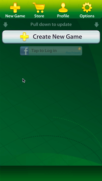
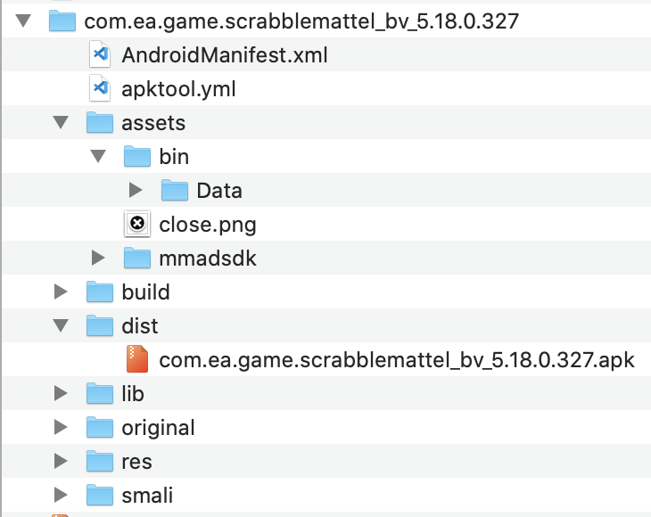
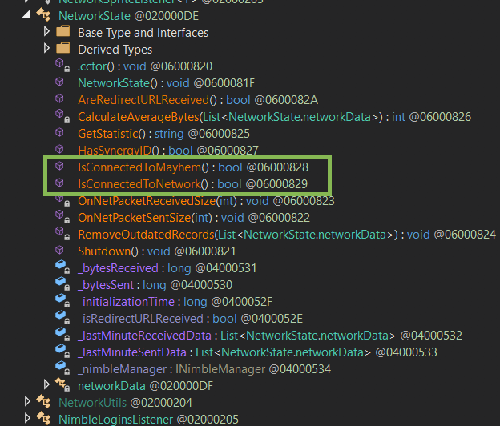
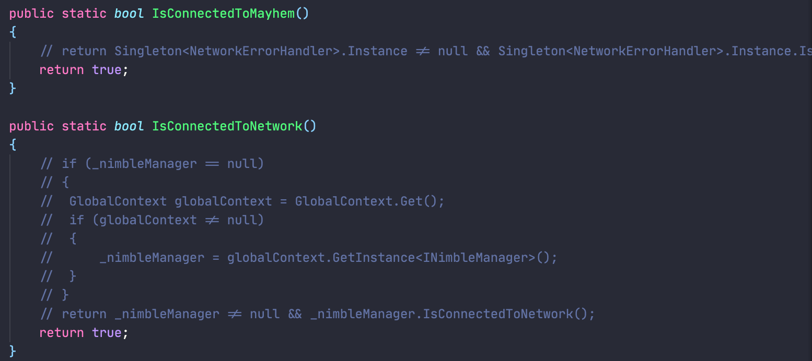

# Scrabble (Electronic Arts) - Hack / Reverse Engineering

FR - [EN](README_EN.md)

## Contexte

Ma grand-mère était habituée à jouer à ce jeu depuis longtemps. Mais EA a décidé pour des raisons obscures de basculer le jeu vers un autre modèle (+ coloré, + jeune, + cher 🤡).
Cette décision a bouleversé pas mal d'utilisateurs, des pétitions ont même été lancées. En vain.
Le premier jeu est devenu inutilisable. Avec une popup qui renvoit directement vers la nouvelle application.

Je n'avais jamais fait de *Reverse Engineering* de ma vie, et cela m'a permis de découvrir pas mal d'outils intéressants. 

Et surtout, ma grand-mère peut toujours jouer à son jeu 🤠

## Démarche

Après vidage du cache et des données de l'application, celle-ci refonctionne jusqu'à la fin du tutorial. Après ça, il est impossible de créer une partie contre l'*IA*. Toutes les actions sont bloquées car le jeu n'arrive pas à contacter les serveurs du jeu, fermés depuis.



Je suis parti dans l'idée de trouver une solution pour que le jeu pense que je suis connecté à ses serveurs.

### Pré-requis

- La dernière version de l'*APK Scrabble* (**5.36.0.938**)
- [APKTOOL](https://ibotpeaches.github.io/Apktool/) => Décompilation + recompilation de l'APK
- [dnSpy](https://github.com/0xd4d/dnSpy) => Décompilation / Recompilation des *DLL*
- *Keytool* + *jarsigner* du [Android SDK](https://developer.android.com/studio/) => Génération d'un certificat perso + signature de l'APK

### Décompilation de l'APK

```terminal
apktool d <nom_de_l'APK>.apk
```



### Décompilation des sources de Unity

Path des ressources / DLL de *Unity*

```terminal
assets > bin > Data > Managed
```


Ce sont ces *DLLs* que nous allons modifier.

### Modification des méthodes

Le *DLL* cible sera **Assembly-CSharp.dll**. C'est lui qui contient le code qui nous intéresse.

1. Ouverture de ce fichier avec le logiciel *dnSpy*.
2. Navigation dans la classe *NetworkState*, pour modifier les fonctions visées.



3. Faire en sorte que ces méthodes renvoient toujours *true*.



4. Sauvegarder

### Re-compilation

1. Recompiler l'*APK* via **APKTOOL**

```terminal
apktool b <dossier_de_decompilation>
```

2. L'APK générée se trouve dans le dossier *dist*

Dans l'état, l'APK ne peut pas être installée. Elle doit être signée.

### Signature de l'APK

1. Générer un certificat / keystore personnel

```terminal
keytool -genkey -keystore keystore.jks -alias scrabble_certificate -keyalg RSA -sigalg SHA256withRSA -validity 2000 -keysize 2048

// -alias => A vous de le choisir
// -validity => A vous de le choisir
```

2. Signer l'application avec ce nouveau certificat

```terminal
jarsigner -verbose -sigalg SHA1withRSA -digestalg SHA1 -keystore keystore.jks <apk_a_signer>.apk scrabble_certificate
```

### Installation et test

1. Dans un émulateur, glisser / déposer l'APK.
2. L'installation se lance
3. Vous pouvez lancer une partie contre l'IA.


### Bilan

Nous avons maintenant la possibilité de re-jouer à ce jeu. Mais ce hack n'est pas optimal 🤡
En effet, l'icône de connexion est toujours présent à l'écran (voir captures), mais le jeu reste fonctionnel !

